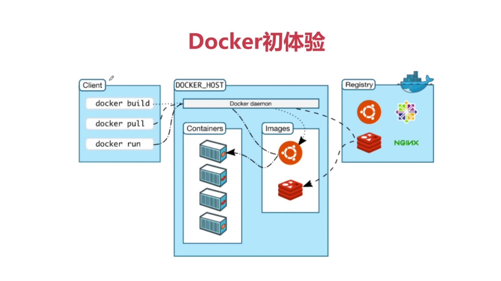

# docker-base

docker的基础命令

##### docker run流程：
客户端向docker daemon发送一条pull命令，docker daemon会先在本机查找镜像，如果没找到则去远程仓库里找，然后把镜像下载到本地，下载回来后通过一定的方式将镜像运行起来，变成docker容器。

搜索下载相关资源


###### win10系统去docker官网下载，一路next安装即可

###### 可去[官网仓库](https://hub.docker.com/)搜索下载相关资源


##### 拉取镜像	
```
docker pull nginx
```


##### 查看本机的镜像  

```
docker images
```


##### 查看正在运行的容器（进程）

```
docker ps
```


##### 运行docker容器

```
docker run nginx
```


##### 后台运行

```
docker run -d nginx
```
###### dockers run 语法
```
docker run [OPTIONS] IMAGE [COMMAND] [ARG...]
OPTIONS说明：

-a stdin: 指定标准输入输出内容类型，可选 STDIN/STDOUT/STDERR 三项；

-d: 后台运行容器，并返回容器ID；

-i: 以交互模式运行容器，通常与 -t 同时使用；

-P: 随机端口映射，容器内部端口随机映射到主机的高端口

-p: 指定端口映射，格式为：主机(宿主)端口:容器端口

-t: 为容器重新分配一个伪输入终端，通常与 -i 同时使用；

--name="nginx-lb": 为容器指定一个名称；

--dns 8.8.8.8: 指定容器使用的DNS服务器，默认和宿主一致；

--dns-search example.com: 指定容器DNS搜索域名，默认和宿主一致；

-h "mars": 指定容器的hostname；

-e username="ritchie": 设置环境变量；

--env-file=[]: 从指定文件读入环境变量；

--cpuset="0-2" or --cpuset="0,1,2": 绑定容器到指定CPU运行；

-m :设置容器使用内存最大值；

--net="bridge": 指定容器的网络连接类型，支持 bridge/host/none/container: 四种类型；

--link=[]: 添加链接到另一个容器；

--expose=[]: 开放一个端口或一组端口；

--volume , -v:	绑定一个卷
```

##### 进入运行容器中执行命令

```
docker exec -it 7ab811911057(容器id) bash       或       docker exec -ti 7ab811911057(容器id) /bin/bash
```


##### 停止运行容器

```
docker stop 7ab811911057(容器id)
```


##### 主机8080端口 映射到 docker容器 80端口 (-P 所有端口跟主机端口进行随机映射)

```
docker run -d -p 8888:80 nginx
```


###### win10查看端口情况
```
netstat
```

