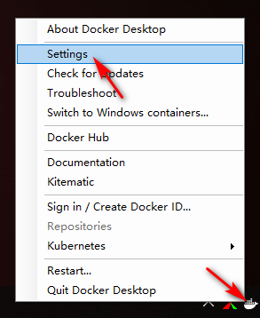
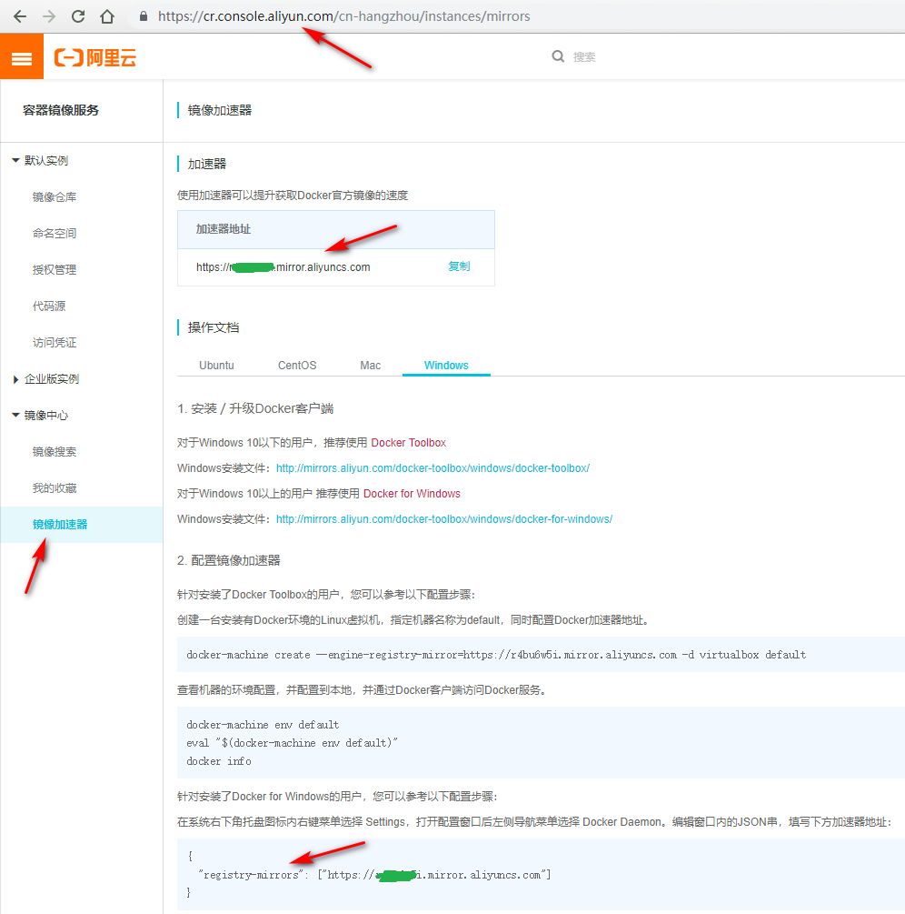
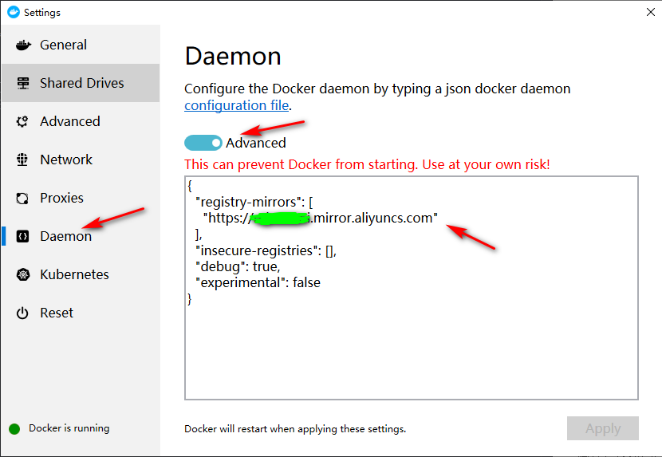
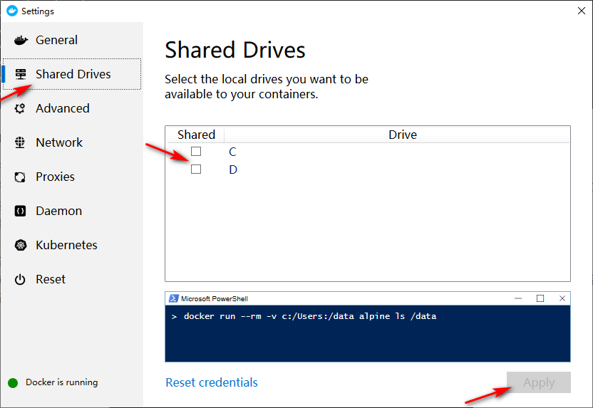
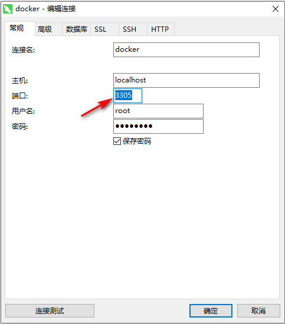
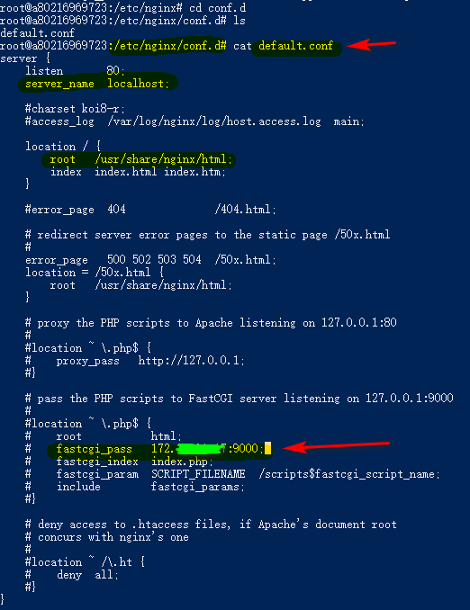
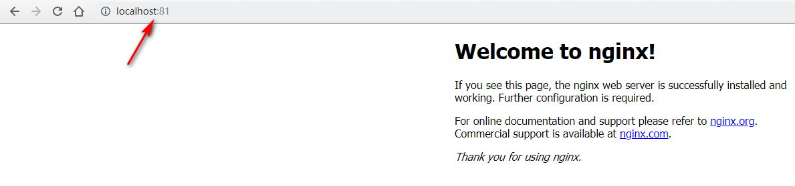

# docker搭建PHP开发环境

在windons环境下搭建

##### docker安装：
在windons下安装docker，参考上一篇README.md即可。

##### 配置docker

1. Docker启动之后右下角有个Docker图标 -> 右键图标 -> 选择settings打开如下界面


2. 选择选择Daemon，点击Basic改为Advanced，在下面的输入框中找到registry-mirrors属性，修改国内镜像源。

3. 可去[阿里云镜像](https://cr.console.aliyun.com/)注册，在镜像加速器中获取加速器地址

4. 把地址填入Daemon=>reqistry-mirrors中。





##### 打开 Windows PowerShell(即cmd) 或者 git bash 	

用管理员权限打开，否则后面涉及到从容器中拷贝文件到宿主机，权限不够会报错，什么tii的错误

##### 安装mysql5.6镜像
1. ``` docker pull mysql:5.6 ```

2. ``` docker run -d --rm --name mysql56 -v D:\docker\mysql:/var/lib/mysql -v D:\docker\mysqlConf:/etc/mysql/conf.d -e MYSQL_ROOT_PASSWORD=root -p 3305:3306 mysql:5.6 --character-set-server=utf8mb4 --collation-server=utf8mb4_unicode_ci ```


```
说明：
-d表示后台运行
--rm表示删除原有的
--name表示命名容器名称（可换）
-v表示绑定宿主机的路径：D:\docker\mysql这是我win10主机的路径（可换），
一定要用“ \ ”，否则会出现什么找不到“D:/docker/mysql”路径的错误提示。
如果提示什么不能共享电脑磁盘，或者别的不能分享什么的，就是要打开docker的setting，在Shared Drives中勾选对应你要绑定的主机磁盘，最后等它重启即可，如下图！！！
-e MYSQL_ROOT_PASSWORD表示mysql的密码
-p 3305:3306表示容器映射主机的端口号，3305是主机的端口号（可换）
```


3. 用Navicat验证下是否可以连接数据库，端口号是上面设置的3305，用户名和密码都是root


##### 安装php5.6镜像
1. ``` docker pull php:5.6 ```

2. ``` docker run -d -v D:\phpStudy\PHPTutorial\WWW:/var/www/html -p 9000:9000 --link mysql56:mysql --name php56 php:5.6-fpm ```

3. 进入容器 ``` docker exec -ti php56 /bin/bash ```

4. 安装PHP扩展 ``` docker-php-ext-install pdo_mysql ``` 和 ``` docker-php-ext-install mysqli ```
    查看扩展是否已经安装 ``` php -m ```

##### 安装Nginx1.10.3镜像
1. ``` docker pull nginx:1.10.3 ```
2. ``` docker run -d -p 81:80 -v D:\phpStudy\PHPTutorial\WWW:/var/www/html --link php56:phpfpm --name nginx110 nginx:1.10.3 ```

3. 进入容器 ``` docker exec -ti nginx /bin/bash ```
    安装vim编辑器，``` apt update ``` 和 ``` apt-get install vim ```

4. 修改配置文件 路径：``` /etc/nginx/conf.d/default.conf ``` 中的 ``` fastcgi_pass ```
    填写主机IP地址，在主机中用ipconfig查看ipv4地址，端口号同mysql，端口号这里是9000


5. 重载nginx容器
    第一种：进入容器中，执行，/etc/init.d/nginx reload
    第二种：在容器外中直接重启nginx容器，docker restart nginx


##### 在windows浏览器中输入localhost:81，或者127.0.0.1:81，(端口号和上面你配置的一致) 查看phpinfo的打印结果。
 

